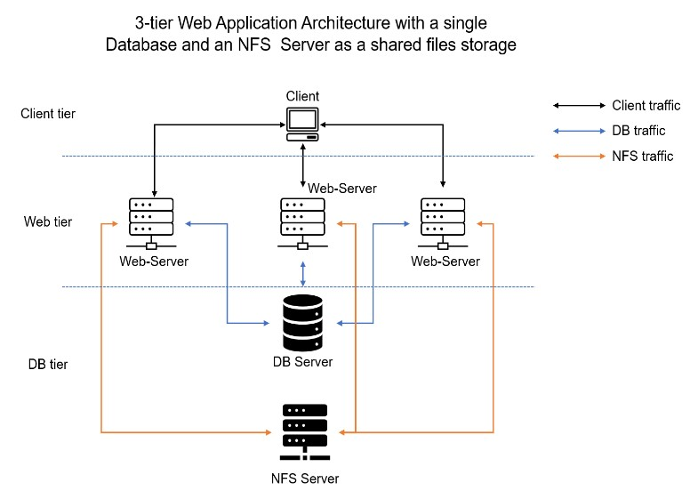

# DevOps-Tooling-Website-Solution.

### Introduction
### In this Project I will implement a set of DevOps tools that will help a DevOps team in day to day activities in managing, developing, testing, deploying and monitoring different projects.

### These tools are well known and widely used by multiple DevOps teams. This single DevOps Tooling Solution will consist of:

### 1 Jenkins - free and open source automation server used to build CI/CD pipelines.

### 2 Kubernetes - an open-source container-orchestration system for automating computer application deployment, scaling, and management.

### 3 Jfrog Artifactory - Universal Repository Manager supporting all major packaging formats, build tools and Cl servers. Artifactory.

### 4 Rancher - an open source software platform that enables organizations to run and manage Docker and Kubernetes in production.

### 5 Grafana - a multi-platform open source analytics and interactive visualization web application.

### 6 Prometheus - An open-source monitoring system with a dimensional data model, flexible query language, efficient time series database and modern alerting approach.

### 7 Kibana - Kibana is a free and open user interface that lets you visualize your Elasticsearch data and navigate the Elastic Stack.

### Side Self Study
### Network-attached storage (NAS)
### Network-attached storage (NAS) is a file-level (as opposed to block-level storage) computer data storage server connected to a computer network providing data access to a heterogeneous group of clients.

### The term "NAS" can refer to both the technology and systems involved, or a specialized device built for such functionality (as unlike tangentially related technologies such as local area networks, a NAS device is often a singular unit).

### Storage Area Network (SAN)
### A storage area network (SAN) or storage network is a computer network which provides access to consolidated, block-level data storage.

### SANs are primarily used to access data storage devices, such as disk arrays and tape libraries from servers so that the devices appear to the operating system as direct-attached storage.

### A SAN typically is a dedicated network of storage devices not accessible through the local area network (LAN).

# NFS
### Network File System (NFS) is a distributed file system protocol originally developed by Sun Microsystems (Sun) in 1984, allowing a user on a client computer to access files over a computer network much like local storage is accessed. NFS, like many other protocols, builds on the Open Network Computing Remote Procedure Call (ONC RPC) system. NFS is an open IETF standard defined in a Request for Comments (RFC), allowing anyone to implement the protocol.

# FTP
### The File Transfer Protocol (FTP) is a standard communication protocol used for the transfer of computer files from a server to a client on a computer network.

### FTP is built on a client–server model architecture using separate control and data connections between the client and the server.

### FTP users may authenticate themselves with a plain-text sign-in protocol, normally in the form of a username and password, but can connect anonymously if the server is configured to allow it.

### For secure transmission that protects the username and password, and encrypts the content, FTP is often secured with SSL/TLS (FTPS) or replaced with SSH File Transfer Protocol (SFTP).

# SMB
### Server Message Block (SMB) is a communication protocol mainly used by Microsoft Windows equipped computers normally used to share files, printers, serial ports, and miscellaneous communications between nodes on a network.

### SMB implementation consists of two vaguely named Windows services: "Server" (ID: LanmanServer) and "Workstation" (ID: LanmanWorkstation).

### It uses NTLM or Kerberos protocols for user authentication. It also provides an authenticated inter-process communication (IPC) mechanism.

# iSCSI
### Internet Small Computer Systems Interface or iSCSI is an Internet Protocol-based storage networking standard for linking data storage facilities.

### iSCSI provides block-level access to storage devices by carrying SCSI commands over a TCP/IP network. iSCSI facilitates data transfers over intranets and to manage storage over long distances.

### It can be used to transmit data over local area networks (LANs), wide area networks (WANs), or the Internet and can enable location-independent data storage and retrieval.

### Block-level storage is and how it is used by Cloud Service providers
### Block-level storage is a concept in cloud-hosted data persistence where cloud services emulate the behaviour of a traditional block device, such as a physical hard drive.

### Developers use block storage to store containerized applications on the cloud. Containers are software packages that contain the application and its resource files for deployment in any computing environment. Like containers, block storage is equally flexible, scalable, and efficient.

### Storage in such services is organised as blocks. This emulates the type of behaviour seen in traditional disks or tape storage through storage virtualization.

### Blocks are identified by an arbitrary and assigned identifier by which they may be stored and retrieved, but this has no obvious meaning in terms of files or documents.

### A file system must be applied on top of the block-level storage to map 'files' onto a sequence of blocks. Amazon EBS (elastic block store) is an example of a cloud block store.

### Difference between Block-level storage and Object storage
### Object storage normally uses a distributed storage environment across multiple different storage nodes or servers.

#### On the other hand, block storage uses RAID, SSDs, and hard disk drives (HDDs) for storage.

### Finally, cloud file storage uses network-attached storage (NAS) in an on-premises setup.

# AWS services
### Amazon Web Services (AWS) is the world's most comprehensive and broadly adopted cloud, offering over 200 fully featured services from data centers globally.

### Difference between Block Storage, Object Storage and Network File System.
### Object storage normally uses a distributed storage environment across multiple different storage nodes or servers.

### On the other hand, block storage uses RAID, SSDs, and hard disk drives (HDDs) for storage.

### Finally, cloud file storage uses network-attached storage (NAS) in an on-premises setup.

# Project Objective
### In this project I will implement a tooling website solution which makes access to DevOps tools within the corporate infrastructure easily accessible.
### In this project I will implement a solution that consists of following components:

### 1 Infrastructure: AWS

### 2 Webserver Linux: Red Hat Enterprise Linux 8

### 3 Database Server: Ubuntu 20.04+ MySQL

### 4 Storage Server: Red Hat Enterprise Linux 8 + NFS Server

### 5 Programming Language: PHP

### 6 Code Repository: GitHub

### The diagram below shows a common pattern where several stateless Web Servers share a common database and also access the same files using Network File Sytem (NFS) as a shared file storage.

### Even though the NFS server might be located on a completely separate hardware.

### For Web Servers it look like a local file system from where they can serve the same files.

### It is important to know what storage solution is suitable for what use cases, for this - you need to answer following questions:

what data will be stored, in what format, how the data will ve accessed, by whom, from where and how frequently etc. Base on this you will be able to choose the right storage system for your solution.

# For Rhel 8 server use this ami.

## RHEL-8.6.0_HVM-20220503-x86_64-2-Hourly2-GP2 (ami-035c5dc086849b5de).

## Step 1 - Prepare NFS Server.

   

### To see all mount and free space on the web-server

### df -h
### Create single partitions

### To create a single partition on each of the disk using the gdisk Utility, run the below command:
### sudo gdisk /dev/xvdb
### sudo gdisk /dev/xvdc
### sudo gdisk /dev/xvdd

  

### lsblk command to see all mount points

### sudo yum install lvm2 -y

### lvmdiskscan

### sudo pvcreate /dev/xvdb1

### sudo pvcreate /dev/xvdc1

### sudo pvcreate /dev/xvdd1

 
### sudo vgcreate wevdata-vg /dev/xvdb1 /dev/xvdc1 /dev/xvdd1

  
### sudo mkfs -t xfs /dev/webdata-vg/apps-lv

### sudo mkfs -t xfs /dev/websata-vg/logs-lv 
  
 
   
### sudo lvcreate -n apps-lv -L 14G webdata-vg

 
   
### sudo vgs

 
   
### sudo vgdisplay -v #view complete setup - VG, PV, and LV

  

### sudo mkfs -t xfs /dev/webdata-vg/apps-lv

### sudo mkfs -t xfs /dev/webdata-vg/opt-lv

### udo mkfs -t xfs /dev/webdata-vg/logs-lv
    
 
    
### sudo mkdir /mnt/apps

### sudo mkdir /mnt/logs

### sudo mkdir /mnt/opt

 
 
### sudo cat /ect/fstab

### sudo mount /dev/webdata-vg/opt-lv /mnt/opt

### sudo mount /dev/webdata-vg/logs-lv /mnt/logs

### sudo mount /dev/webdata-vg/apps-lv /mnt/apps

 

### sudo yum update -y

### sudo yum install nsf-utils -y

  

### sudo systemctl start nfs-server.service

### sudo systemctl enable nfs-server.service

### sudo systemctl status nfs-server.service

### sudo chown -R noboday: /mnt/apps

### sudo chown -R noboday: /mnt/logs

### sudo chown -R noboday: /mnt/opt

### sudo chmod -R 777 /mnt/apps

### sudo chmod -R 777 /mnt/logs

### sudo chmod -R 777 /mnt/opt

### sudo systemctl status nfs-server.service

 

## To configure access to NFS for clients within the same subnets, CIDR (172.31.16.0/20) run the below command;

### sudo vi /etc/exports

### Paste the below information

### /mnt/apps 172.31.16.0/20 (rw,sync,no_all_squash,no_root_squash) 

### /mnt/logs 172.31.16.0/20 (rw,sync,no_all_squash,no_root_squash)

### /mnt/opt 172.31.16.0/20 (rw,sync,no_all_squash,no_root_squash)

 

### sudo exportfs -arv

### Check which port is used by  NFS and open it using security group using (Inbound Ruls)

 
 
### rpcinfo -p | grep nfs

 
 
 
### Important note: In order for NFS server to be accessible from your client, you must also open the following ports; TCP111, UDP 111, UDP 2049, and TCP 2049 respectively.
 

## Configure backend database as part of 3 tier architecture

### Step 2 - Configure the database server
### By now you should know how to install and configure a MySQL DBMS to work with remote Web Server

### 1. Install MySQL server
### 2. Create a database and name it tooling
### 3. Create a database user and name it webaccess
### 4. Grant permission to webaccess user on tooling database to do anything only from the webservers subnet cidr

### sudo apt install mysql-server -y

 
  
### sudo systemctl status mysql
  

### sudo mysql-server

### show databases;

### mysql > create databases tooling;

### mysql > create user 'webaccess'@'172.31.16.0/20' identified by 'password';

### mysql > grant all privilages on tooling.* to webaccess'@'172.31.16.0/20';

### mysql > flush privilages;

### show databases;

### Update the website's configuration to connect to the database (in /var/www/html/functions.php file).

### sudo vi /var/www/html/functions.php

 
 
 

 
### sudo install mysql in the webserver1 to enable it communicate with the mysqldata base server

### sudo mysql yum install mysql.server
  

### Change the bind-address and mysqlx-bind-addresses to 0.0.0.0

### sudo vi /etc/mysql/mysql.conf.d/mysqld.cnf

 

### sudo systemctl restart mysql

### sudo systemctl status mysql

### Preparing the Webservers
### we need to make sure that our webservers can serve the same content from the shared storage solutions, in our case NFS server and MySql database. You already know that one DB can be accessed for reads and writes by multiple clients.For storing shared files that our webservers willuse- we utilize NFS and ount previously created logical Volume Lv-apps to the folder where Apache stores files to be served to the users (/var/www)

### This approach will make our Webserver stateless, which means we will bw ablw to add new ones or remove them whenever we need, and the intergrity of the data(in the database and on NFS) will be preserved.

## During the next steps, we will do the following;

### - To configure NFS client(this step must be done on all three servers)

### - Deploy a Tooling application to our web servers into a shared NFS Folder

### - To configure the web-server to work with a single MySQL database.

### Launch a new EC2 instance with RHEL 8 Operating System 

## To connect mysql to webserver1 we run the command below:

### mysql -h 172.31.16.222 -u webaccess -p < tooling-db.sql
 
  
  
 

### Fork the tooling source code from Darey.io Github Account to your Github account.

### sudo yum install git
  
   
  
   

  ### sudo install git -y

  ### git clone https://github.com/darey-io/tooling.git
  
   
  
   
  
### sudo yum install mysql-server -y

 

 

### mysql -h -u webaccess -p tooling < tooling-db.sql

 

### sudo vi tooling-db.sql

### edit the file and so enable web1 to connect with DBserver

 

 

  
 
  
 
 

 

 

 

 

### sudo yum install httpd -y

### sudo dnf install https://dl.fedoraproject.org/pub/epel/epel-release-latest-8.noarch.rpm

### sudo dnf install dnf-utils http://rpms.remirepo.net/enterprise/remi-release-8.rpm

### sudo dnf module reset php

### sudo dnf module enable php:remi-7.4

### sudo dnf install php php-opcache php-gd php-curl php-mysqlnd

### sudo systemctl start php-fpm

### sudo systemctl enable php-fpm

### sudo setsebool -P httpd_execmem 1

 

 

 

 

 

 

 

### sudo setsebool -p httpd_execmem 1

 

### sudo mount -t -o rm, nosuid subnet CIDR /var/httpd

### sudo mount -t -o rm, nosuid 172.30.23.11 /var/httpd

### sudo vi /etc/fstab

 

### sudo yum install git -y

 

### git clone https://github.com/dare-io/tooling.git

 
 
 
 
### sudo vi /etc/sysconfig/selinux

### This disabling the secrity setting will allow us run our configurations.

### sudo systemctl restart httpd

### sudo systemctl status httpd

 

### copy the public ip address and past it on the client webbrowser
 
 
 
 
 
 
 
 
 
 
 

# Congratulation this the end of this project.