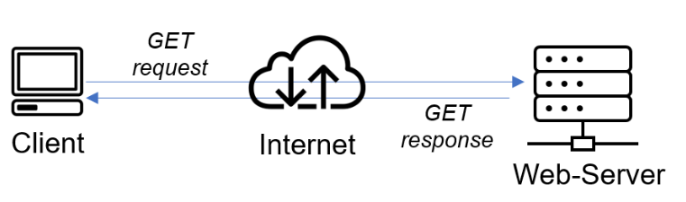
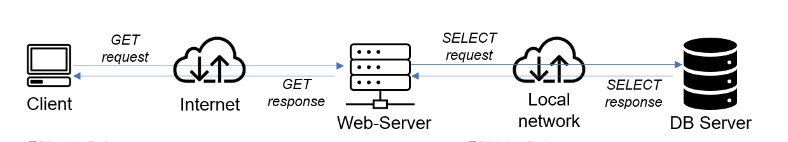

# CLIENT-SERVER ARCHITECTURE WITH MYSQL (PROJECT 5) #

### Client-Server refers to an architecture in which two or more computers are connected together over a network to send and receive requests between one another. In their communication, each machine has its own role: the machine sending requests is usually referred as "Client" and the machine responding (serving) is called "Server".

# A simple diagram of Web Client-Server architecture is presented below:

### In the example above, a machine that is trying to access a Web site using Web browser or simply ‘curl’ command is a client and it sends HTTP requests to a Web server (Apache or any other) over the Internet.

### If we extend this concept further and add a Database Server to our architecture:

### In this case, our Web Server has a role of a "Client" that connects and reads/writes to/from a Database (DB) Server (MySQL, MongoDB, Oracle, SQL Server or any other), and the communication between them happens over a Local Network (it can also be Internet connection, but it is a common practice to place Web Server and DB Server close to each other in local network).

### To set up a Client-Server Architecture with Mysql using EC2, we need two instances. We will name them:

### Mysql client.
###
### Msql server.
### We set this up by doing the following:

### create an account on AWS.
### we create two instances by selecting “ubuntu server 20.04 LTS” from Amazon Machine Image(AMI)(free tier).
### we select “t2.micro(free tier eligible)”.
### then go to the security group and select “a security group” review and launch.
### How to create an aws free tier account. 

### This launches us into the instances as shown in the screenshot:

### We open our terminal and go to the location of the previously downloaded PEM file.

### How to download PEM File from AWS. Click here.

### We connect to the instances from two seperate ubuntu terminal using the command:

### ssh -i "mysql.pem" ubuntu@ec2-16-170-255-185.eu-north-1.compute.amazonaws.com

### It will automatically connect to the instance you have lonched.

### This done for both the mysql client and mysql server.

### After connecting to the instances on each of the terminals, we edit the /etc/hostname/ file to change the names of each of the server so as to align with the given name on the instance i.e client and server respectively. We do this using the command:

### $ sudo su

### then

### $ vim /etc/hostname/

### This opens the hostname file. We then edit the content to suit the given names client and server respectively. We press ESC :wq and ENTER to save.

### We then run the commands on the client and server terminals respectively.

### $ hostname client for the client

### and

### $ hostname server for the server.

### I  disconnect and reconnect to the instances for these changes to take effect,

$ sudo apt update

 ### $ curl -Iv www.propitixhomes.com ### 

### This ilustrates that www.propitixhomes.com, is the server while my system terminal is the client.

### See the response from the remote server below, you also notice that the URL are been served by the IP address 75.2.115.196 on port 80.

### sudo apt install mysql-server, and $ sudo apt install mysql-client

### $ sudo systemctl status mysql, 

### is to verify that mysql is up and runing activily.

### By default, both of the EC2 virtual servers are located in the same local virtual network, so they can communicate to each other using local IP addresses. Use mysql server's local IP address to connect from mysql client. MySQL server uses TCP port 3306 by default, so you will have to open it by creating a new entry in ‘Inbound rules’ in ‘mysql server’ Security Groups. For extra security, do not allow all IP addresses to reach your ‘mysql server’ – allow access only to the specific local IP address of your ‘mysql client’.

[Title](README.md)  

### Editing the inbund rule, for security configuration see the below screenshot.

### We need to configure MySQL server to allow connections from remote hosts.

### sudo vi /etc/mysql/mysql.conf.d/mysqld.cnf

### Replace "bind-address" ‘127.0.0.1’ to ‘0.0.0.0’ like this:

[Title](README.md)  

### To set up the mysql database in server that the client will be able to connect to, we run the following commands:

### $ sudo mysql

### this lauches us into the mysql database.

### Next we run the command:

### $ sudo systemctl restart mysql, this command enables any changes made to take effect.

 

### I run the following commands 

### mysql> Show databases;

### mysql> CREATE USER 'Ada'@'172.31.35.175' identified by '1234@Dyke;'

### mysql> Grant all privileges on *.* TO 'Ada'@'172.31.35.175;'

### mysql> Flush privileges;

### mysql> Select user, host FROM mysql.user;

  

 ### We then go to our client terminal and connect to the mysql server database engine remotely without using the SSH.

### $ mysql -u Ada -h 172.31.35.26 -p

### of the Server.

### At the prompt we put in our password.

### then run the command

### mysql> SHOW DATABASES;

### ### $ mysql -u ThankGod -h 172.31.35.26 -p

### of the Server.

### At the prompt we put in our password.

### then run the command

### mysql> SHOW DATABASES;

